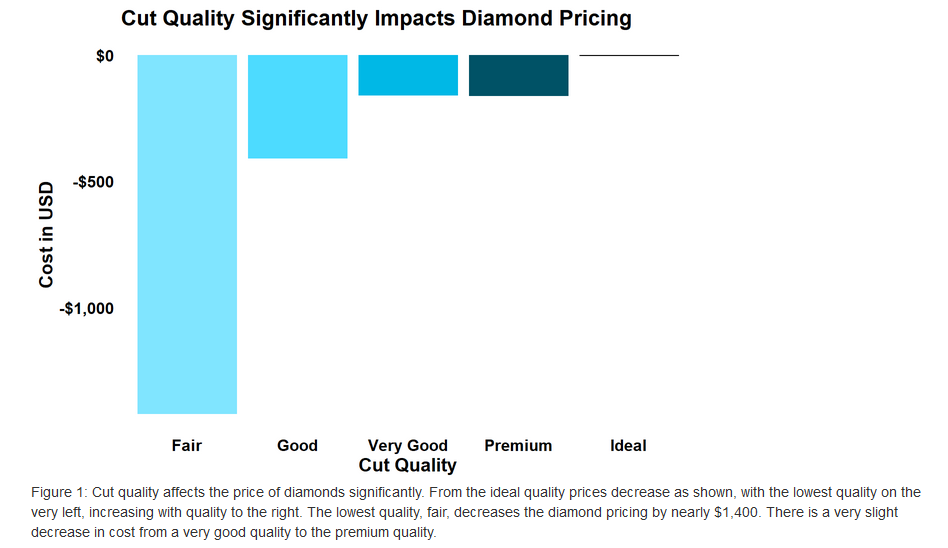
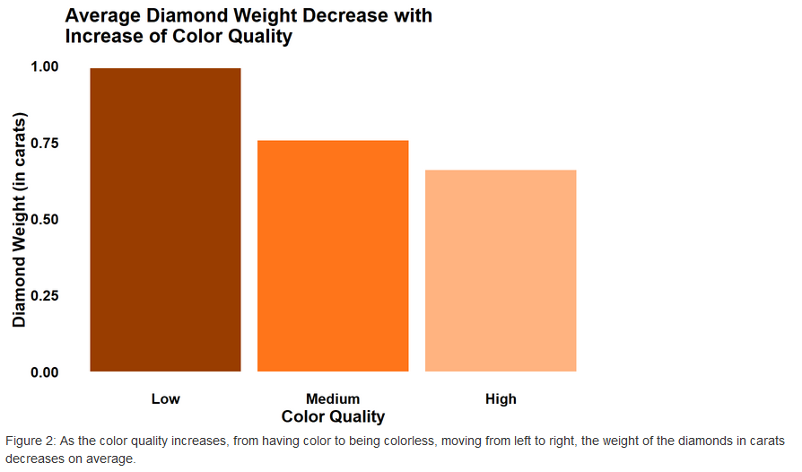
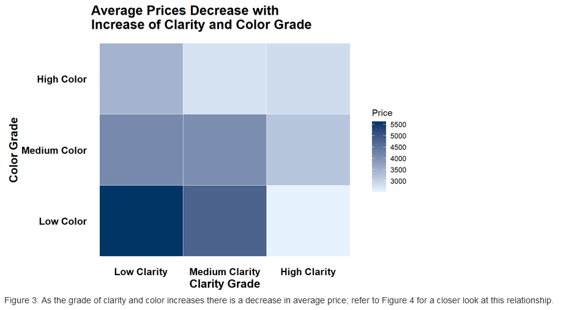

# Diamond Analysis💎

This report is an analysis on the diamonds dataset and what terms make impacts on the prices of the diamonds. This analysis will have seven sections. The first section will assess the model built for evaluating the price. The second section will look at the cut of the diamonds, and the relationship the other terms have on the diamond's cut. Third, this report will explore the interaction of the color and carat of the diamonds. Similarly, fourth, this report will explore the interaction of the color and clarity. The fifth section will detail the importance of the interaction terms within the model. The sixth section will assess important terms to determine he price of the diamonds other than the carat. Lastly, in this report we will build a training model and use that model to attempt predicting the price of diamonds. 

Our diamonds dataset is a comprehensive collection diamond data from our suppliers, representing various attributes of a large number of diamonds. The dataset includes the following attributes:

    Carat: Numeric. Represents the weight of the diamond, measured in carats. A higher carat number indicates a heavier diamond.

    Cut: Categorical. Indicates the quality of the cut of the diamond, which affects its symmetry, brightness, and overall appearance. The categories include Fair, Good, Very Good, Premium, and Ideal, with Ideal being the highest quality.

    Color: Categorical. Denotes the color grade of the diamond, which ranges from J (lowest grade, more color) to D (highest grade, colorless). The grading scale moves from a noticeable color to colorless.

    Clarity: Categorical. Describes the clarity of the diamond, which refers to the absence of inclusions and blemishes. The categories range from I1 (Inclusions 1, lowest clarity) to IF (Internally Flawless, highest clarity).

    Depth: Numeric. The depth percentage of the diamond, calculated as the ratio of the diamond’s total depth (from table to culet) to its average diameter.

    Table: Numeric. Refers to the width of the top facet of the diamond, known as the table, relative to the widest point of the diamond. It is expressed as a percentage.

    Price: Numeric. The price of the diamond in US dollars.

    X: Numeric. The length of the diamond in millimeters.

    Y: Numeric. The width of the diamond in millimeters.

    Z: Numeric. The depth of the diamond in millimeters.

    Supplier: Categorical. Represents the supplier of the diamonds to a major online marketplace (e.g., Amazon). Each diamond is sourced from one of several suppliers, each with varying reputations and qualities of service. The suppliers are anonymized and labeled as “Supplier A”, “Supplier B”, “Supplier C”, etc.
